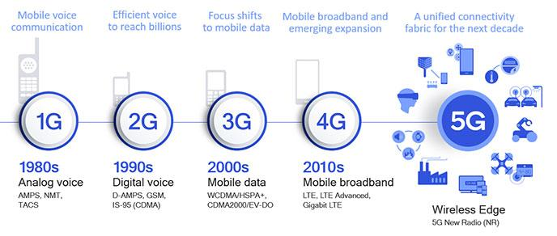
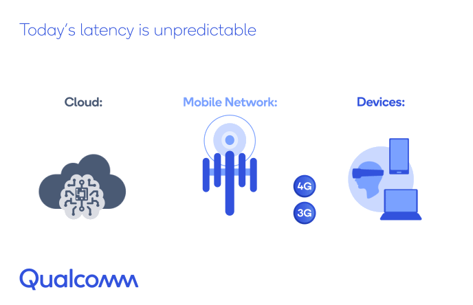

# FROM 1G TO 5G

First mobile phones had to be packed in a *briefcase!* Mobile technology has come a long way. It will play a crucial role in technologies of the future like *IoT* and *autonomous vehicles!* Let us look at the evolution from 1G to 5G

#### WHAT ARE CELLULAR NETWORKS AND WHY ARE THEY IMPORTANT?

------

Networks are a group of connected devices. A common network architecture has all devices connected by 'links'. When the devices can move from one place to another these 'links' are *wireless*. The networks where the end devices are connected to the network wirelessly are called cellular networks. Mobile phones are classic examples of cellular networks. In the future, IoT devices and autonomous vehicles shall form a cellular network. 

 

To provide service over a land area, the total land area is divided into '*cells*'. Cells are conventionally chosen as *hexagons*. Each cell contains at least one *base station* (aka mobile tower). All the base stations are connected to the *core network*. The core network is like the *brain* of the network. It controls the information flow

#### WHAT HAPPENS WHEN YOU TALK TO SOMEONE ON YOUR PHONE?

------

Your voice is converted into *digital data* by your handset. This digital data is replicated in a *radio wave* by changing the wave's particular characteristics such as phase, frequency, or amplitude. These waves are radiated by the handset. A very *small* part reaches the antenna of the nearest base station. From here the signal is sent to your *mobile operator's (Idea, Jio, etc.) core network* via the transmission link. It transfers the call to your friend's mobile operator's core network, which directs the call to the nearest base station to your friend. This base station radiates radiowaves which reach your friend's handset. The earpiece inside converts signal to audio and finally, your friend can hear you!

Mobile data works similarly. Instead of transferring a call to the friend's mobile operator's core network, the core network would access the internet and send information back to you.

*Roughly every 10 years, the industry decides to make this process faster, more reliable, more secure and, increase the capacity of networks to serve more devices. These standards of performance are better known as 'generations' or simply 'G'. 5G is the latest set of standards.*

##### IMPORTANT TERMINOLOGY

------

###### CHANNEL

The space between a mobile phone and the base station. It carries the radiowaves. The channel is very *unpredictable*. It is continuously changing and consists of everything around us including us! Communication through the channel is possible in a specific frequency range called the *spectrum*.

###### BANDWIDTH OF NETWORK

The range of frequencies with which mobile phones and base stations have agreed to communicate is called the *bandwidth* of the network. Since the channel is capable of carrying a certain range of frequencies without distortion, the bandwidth has a limit. The number of devices using the network is increasing. Hence each generation uses available bandwidth more efficiently and finds ways of increasing bandwidth. 

###### PEAK DATA RATE

The theoretical maximum rate at which mobile phones can send information on the network, or receive information from the network. Each generation increases the peak data rate.

###### THROUGHPUT

The actual rate at which mobile phones send and receive information from the network is called the throughput. It is generally much less than the peak data rate and, depends on several factors.

 

#### 1G

------

The first mobile network, now called 1G, started in Japan in 1979. Unlike today's cell phones which use digital methods to store and transmit information, devices of this generation used *analog signals* to store and transmit information. The peak data rate was only *2.4 Kbps*.

​                         Motorola DynaTAC weighed a little less than a *kilo* and took *10 hours* to charge!

#### 2G

------

2G mobile networks began in Finland in 1991. They were based on the *GSM* (Global System for Mobile Communications) standards. The major change in this generation was the use of *digital* methods to store and send information. This allowed calls and text encryption, SMS (Short Messaging Service), picture messaging and, MMS (Multimedia Messaging Service). Equipment all around the world was manufactured according to the GSM standard. This introduced uniformity in network technology across regions. Hence roaming became possible. The peak data rate was *50 Kbps*.

​                                                          Nokia 3210 sold about 160 million units

#### 3G

------

The first pre-commercial 3G network was launched by NTT DoCoMo in Japan in 1998. It was based on *WCDMA* (Wideband Code Division Multiple Access) which uses the spectrum more efficiently. This was a natural evolution from GSM. It gives a peak data rate of *2Mbps* for *stationery* users and *384Kbps* for moving users. The biggest success of 3G was the introduction of *mobile data*. The arrival of smartphones in the early part of this generation increased the usage of 3G mobile data. New applications of 3G were mobile TV, GPS location tracking and, video calls.

#### 4G

------

The growth in mobile data was so fast that the industry started planning a major new network upgrade based on Internet Protocol(IP). The new technology, *Long Term Evolution (LTE)* became known as 4G. The first network was launched at the end of 2009. Within 4 years there were more than 250 others, making it the fastest-growing generation. It uses *OFDM(Orthogonal Frequency Division Multiplexing)* technology which is far more spectrum efficient. It has a peak data rate of *400Mbps* and a typical throughput of a good 4G network will be *10s of Mbps* for moving users and *100s of Mbps* for stationary users. High Definition online TV, High Definition online gaming, videoconferencing became possible with 4G.

As more people get access to smartphones and the IoT network expands, *billions* of devices shall need access to a mobile network. That is where 5G comes in.

### 5G

------

5G differs from 4G in three important aspects, *bandwidth*, *latency*, and *peak data rate*. 

##### Bandwidth

4G uses frequencies less than 3GHz. 5G uses each bit of spectrum. *Low bands* below 1GHz, *mid bands* with frequency in 1GHz to 6GHz and, *high bands* beyond 30GHz. Waves in high bands have wavelengths of the order of a millimeter. Hence 5G uses *mm-wave technology*. There is a problem with using frequencies beyond 30GHz. The high-frequency radio waves lose significant energy on encountering an obstacle like a wall or tree. These waves are *short range*. One possible solution is to use more base stations. 

##### Latency

Latency means 'delay'. Time taken by your phone to show results of a google search is one kind of latency in a network. The core network controls the flow of information. It is the 'intelligence' of the network. For faster decisions, this intelligence is *distributed*. Information relevant to a device is stored close to the device. This is called *edge cloud* and *edge computing*. Edge cloud can be used when low latency is necessary and for latency tolerant applications core network will be accessed. Unfortunately, latency is a very unpredictable parameter. Even with 5G, there shall be wide variations in the latency depending on the quality of the network.

##### Peak data rate

The peak data rate of 5G will be *20Gbps*. This is about 50 times the peak data rate of 4G. For typical 5G network throughput could be in Gbps.

Currently, 5G has been deployed at a few places in South Korea, the USA and, other countries. Although several organizations are working towards realizing the full potential of 5G, the success of 5G also depends upon government regulations. There is no doubt that 5G holds a lot of promise for the future. From *virtual reality* and *autonomous vehicles* to *industrial internet* and *smart cities* 5G will be at the heart of the future of communications!

REFERENCES

What happens when you talk to someone on your phone? - [Introducing Radio Spectrum](https://www.gsma.com/spectrum/wp-content/uploads/2017/04/Introducing-Radio-Spectrum.pdf) from [gsma.com](gsma.com)

1G, 2G, 3G, 4G - [Key differences between 3G, 4G, 5G](https://www.verizon.com/about/our-company/5g/difference-between-3g-4g-5g) from [verizon.com](verizon.com)

 [Introducing Radio Spectrum](https://www.gsma.com/spectrum/wp-content/uploads/2017/04/Introducing-Radio-Spectrum.pdf) from [gsma.com](gsma.com)

5G - [Q&A on 5G](https://www.qualcomm.com/invention/5g/what-is-5g#:~:text=5G%20will%20bring%20wider%20bandwidths,Gbps%20throughput%2C%20and%20low%20latency.) from [qualcomm.com/invention](https://www.qualcomm.com/invention/5g)

 [Latency solutions](https://www.qualcomm.com/news/onq/2019/05/13/how-5g-low-latency-improves-your-mobile-experiences#:~:text=The%20current%20architecture%20is%20a,is%20changing%20now%20with%205G.&text=Edge%20computing%20reduces%20latency%20because,to%20the%20cloud%20and%20back.) from [qualcomm.com/news](https://www.qualcomm.com/news/onq/2019/05/13/how-5g-low-latency-improves-your-mobile-experiences#:~:text=The%20current%20architecture%20is%20a,is%20changing%20now%20with%205G.&text=Edge%20computing%20reduces%20latency%20because,to%20the%20cloud%20and%20back.)

 [Introducing Radio Spectrum](https://www.gsma.com/spectrum/wp-content/uploads/2017/04/Introducing-Radio-Spectrum.pdf) from [gsma.com](
